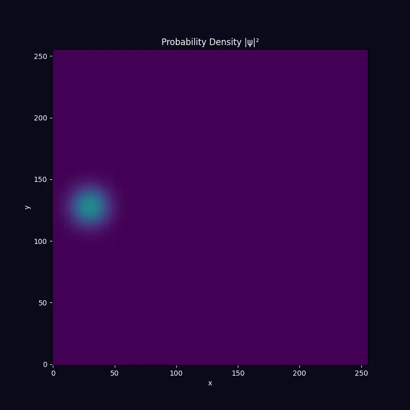
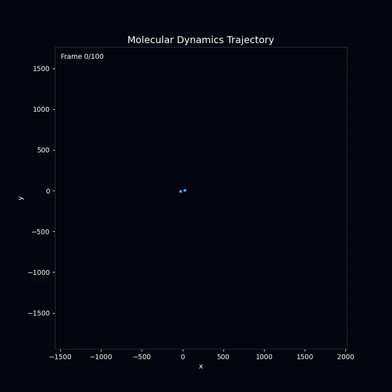
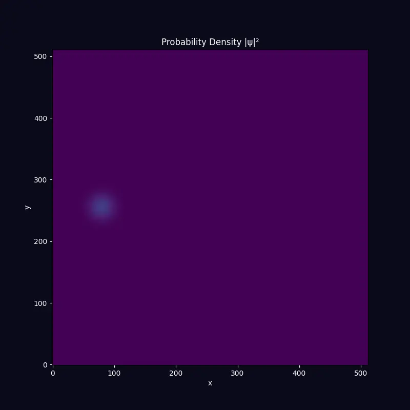
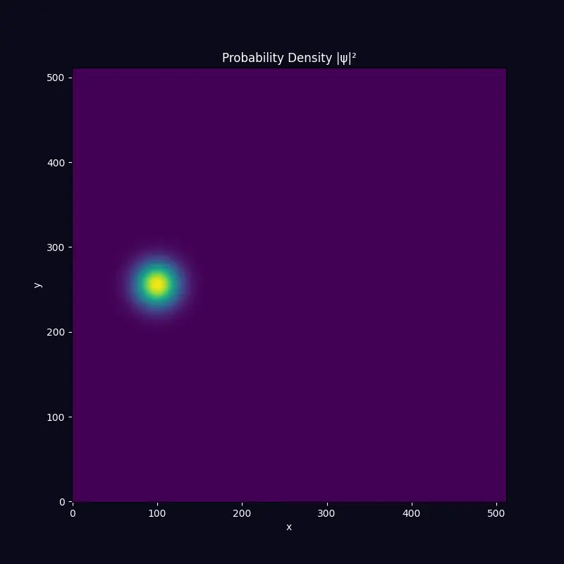

# Math-Physics-ML MCP System

[](https://pypi.org/project/scicomp-math-mcp/)
[](https://pypi.org/project/scicomp-quantum-mcp/)
[](https://pypi.org/project/scicomp-molecular-mcp/)
[](https://pypi.org/project/scicomp-neural-mcp/)
[](https://andylbrummer.github.io/math-mcp/)
[](https://opensource.org/licenses/MIT)

GPU-accelerated [Model Context Protocol](https://modelcontextprotocol.io) servers for computational mathematics, physics simulations, and machine learning.

## 📚 Documentation

**[View Full Documentation →](https://andylbrummer.github.io/math-mcp/)**

| Guide | Description |
|-------|-------------|
| [Installation](https://andylbrummer.github.io/math-mcp/getting-started/installation) | Setup instructions for pip, uv, and uvx |
| [Configuration](https://andylbrummer.github.io/math-mcp/getting-started/configuration) | Claude Desktop & Claude Code setup |
| [Quick Start](https://andylbrummer.github.io/math-mcp/getting-started/quick-start) | Get running in 5 minutes |
| [API Reference](https://andylbrummer.github.io/math-mcp/api/overview) | Complete tool documentation |
| [Visual Demos](https://andylbrummer.github.io/math-mcp/demos/) | Interactive physics simulations |

## About

This system enables AI assistants to perform real scientific computing — from solving differential equations to running molecular dynamics simulations.

<table>
<tr>
<td align="center" width="50%">

<br/><b>Quantum Wave Mechanics</b><br/>
<sub>Double-slit interference pattern from solving the time-dependent Schrödinger equation</sub>
</td>
<td align="center" width="50%">

<br/><b>N-Body Dynamics</b><br/>
<sub>Galaxy merger simulation using gravitational N-body calculations</sub>
</td>
</tr>
<tr>
<td align="center" width="50%">

<br/><b>Crystal Diffraction</b><br/>
<sub>Bragg scattering from a hexagonal (graphene-like) lattice</sub>
</td>
<td align="center" width="50%">

<br/><b>Multi-Slit Interference</b><br/>
<sub>Complex interference patterns from three coherent sources</sub>
</td>
</tr>
</table>

## Overview

This system provides **4 specialized MCP servers** that bring scientific computing capabilities to AI assistants like Claude:

| Server | Description | Tools |
|--------|-------------|-------|
| **Math MCP** | Symbolic algebra (SymPy) + numerical computing | 14 |
| **Quantum MCP** | Wave mechanics & Schrodinger simulations | 12 |
| **Molecular MCP** | Classical molecular dynamics | 15 |
| **Neural MCP** | Neural network training & evaluation | 16 |

**Key Features:**
- GPU acceleration with automatic CUDA detection (10-100x speedup)
- Async task support for long-running simulations
- Cross-MCP workflows via URI-based data sharing
- Progressive discovery for efficient tool exploration

## Quick Start

### Installation with uvx (Recommended)

Run any MCP server directly without installation:

```bash
# Run individual servers
uvx scicomp-math-mcp
uvx scicomp-quantum-mcp
uvx scicomp-molecular-mcp
uvx scicomp-neural-mcp
```

### Installation with pip/uv

```bash
# Install individual servers
pip install scicomp-math-mcp
pip install scicomp-quantum-mcp
pip install scicomp-molecular-mcp
pip install scicomp-neural-mcp

# Or install all at once
pip install scicomp-math-mcp scicomp-quantum-mcp scicomp-molecular-mcp scicomp-neural-mcp

# With GPU support (requires CUDA)
pip install scicomp-math-mcp[gpu] scicomp-quantum-mcp[gpu] scicomp-molecular-mcp[gpu] scicomp-neural-mcp[gpu]
```

## Configuration

### Claude Desktop

Add to your Claude Desktop configuration file:

**macOS**: `~/Library/Application Support/Claude/claude_desktop_config.json`
**Windows**: `%APPDATA%\Claude\claude_desktop_config.json`

```json
{
  "mcpServers": {
    "math-mcp": {
      "command": "uvx",
      "args": ["scicomp-math-mcp"]
    },
    "quantum-mcp": {
      "command": "uvx",
      "args": ["scicomp-quantum-mcp"]
    },
    "molecular-mcp": {
      "command": "uvx",
      "args": ["scicomp-molecular-mcp"]
    },
    "neural-mcp": {
      "command": "uvx",
      "args": ["scicomp-neural-mcp"]
    }
  }
}
```

### Claude Code

Add to your project's `.mcp.json`:

```json
{
  "mcpServers": {
    "math-mcp": {
      "command": "uvx",
      "args": ["scicomp-math-mcp"]
    },
    "quantum-mcp": {
      "command": "uvx",
      "args": ["scicomp-quantum-mcp"]
    }
  }
}
```

Or configure globally in `~/.claude/settings.json`.

## Usage Examples

### Math MCP

```python
# Solve equations symbolically
symbolic_solve(equations="x**3 - 6*x**2 + 11*x - 6")
# Result: [1, 2, 3]

# Compute derivatives
symbolic_diff(expression="sin(x)*exp(-x**2)", variable="x")
# Result: cos(x)*exp(-x**2) - 2*x*sin(x)*exp(-x**2)

# GPU-accelerated matrix operations
result = matrix_multiply(a=matrix_a, b=matrix_b, use_gpu=True)
```

### Quantum MCP

```python
# Create a Gaussian wave packet
psi = create_gaussian_wavepacket(
    grid_size=[256],
    position=[64],
    momentum=[2.0],
    width=5.0
)

# Solve time-dependent Schrodinger equation
simulation = solve_schrodinger(
    potential=barrier_potential,
    initial_state=psi,
    time_steps=1000,
    dt=0.1,
    use_gpu=True
)
```

### Molecular MCP

```python
# Create particle system
system = create_particles(
    n_particles=1000,
    box_size=[20, 20, 20],
    temperature=1.5
)

# Add Lennard-Jones potential
add_potential(system_id=system, potential_type="lennard_jones")

# Run MD simulation
trajectory = run_nvt(system_id=system, n_steps=100000, temperature=1.0)

# Analyze diffusion
msd = compute_msd(trajectory_id=trajectory)
```

### Neural MCP

```python
# Define model
model = define_model(architecture="resnet18", num_classes=10, pretrained=True)

# Load dataset
dataset = load_dataset(dataset_name="CIFAR10", split="train")

# Train
experiment = train_model(
    model_id=model,
    dataset_id=dataset,
    epochs=50,
    batch_size=128,
    use_gpu=True
)

# Export for deployment
export_model(model_id=model, format="onnx", output_path="model.onnx")
```

## Development

```bash
# Clone the repository
git clone https://github.com/andylbrummer/math-mcp.git
cd math-mcp

# Install dependencies
uv sync --all-extras

# Install MCP servers in editable mode (required for entry points)
uv pip install --python .venv/bin/python \
  -e servers/math-mcp \
  -e servers/quantum-mcp \
  -e servers/molecular-mcp \
  -e servers/neural-mcp

# Run tests
uv run pytest -m "not gpu"  # CPU only
uv run pytest               # All tests (requires CUDA)

# Run with coverage
uv run pytest --cov=shared --cov=servers
```

> **Note**: The editable install step is required because `uv sync` doesn't install entry point scripts for workspace packages. After this step, you can run servers directly with `uv run scicomp-math-mcp`.

See [CONTRIBUTING.md](CONTRIBUTING.md) for development guidelines.

## Performance

GPU acceleration provides significant speedups for compute-intensive operations:

| MCP | Operation | CPU | GPU | Speedup |
|-----|-----------|-----|-----|---------|
| Math | Matrix multiply (4096x4096) | 2.1s | 35ms | 60x |
| Quantum | 2D Schrodinger (512x512, 1000 steps) | 2h | 2min | 60x |
| Molecular | MD (100k particles, 10k steps) | 1h | 30s | 120x |
| Neural | ResNet18 training (1 epoch) | 45min | 30s | 90x |

## Architecture

For technical details about the system architecture, see [ARCHITECTURE.md](ARCHITECTURE.md).

## License

MIT License - see [LICENSE](LICENSE) for details.

## Contributing

Contributions are welcome! Please see [CONTRIBUTING.md](CONTRIBUTING.md) for guidelines.
